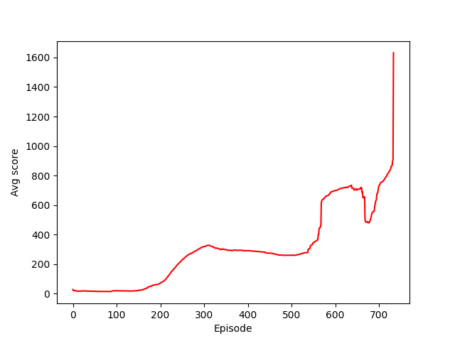

This repository showcases the implementation of various Reinforcement Learning (RL) algorithms. The algorithms, or agents, are organized within modules for ease of use. To get started, install the entire package via pip: `pip install -e.`
For convenience, both training and testing are in Jupyter notebooks.

**Algorithms Implemented**
1. Deep-Q Network (DQN)
2. To be added...

**Games/Environments Tested**
1. Cart-pole
2. Lunar Lander (discrete actions)
3. Lunar Lander (continuous actions)
4. Bipedal Walker
5. To be added...

**Dependencies**

Refer to the environment.yml file to create the virtual environment. Note that `gym` is not included in this file, as its installation method may vary across different operating systems. Ensure that you have `gym` installed correctly on your machine.

**Hardware Used**

The experiments were conducted on a MacBook Pro 16-inch M1 with CPU. The GPU was not activated due to its inconsistent performance.

**Discussion**

1. Deep-Q Network (DQN) \
a) Cart-pole:
Achieved a score of 500 after approximately 15 minutes of training.
Further training would likely result in even higher scores.

    

        
        
Demo GIF

    

    

        
        
DQN Architecture

    

