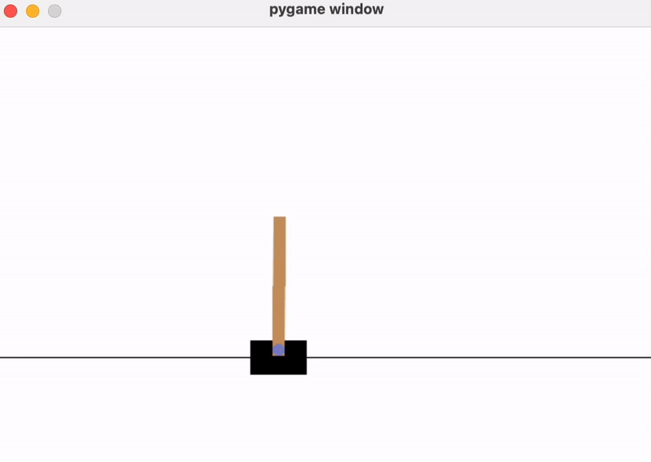
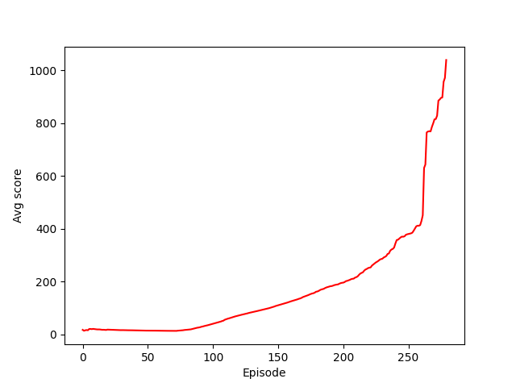
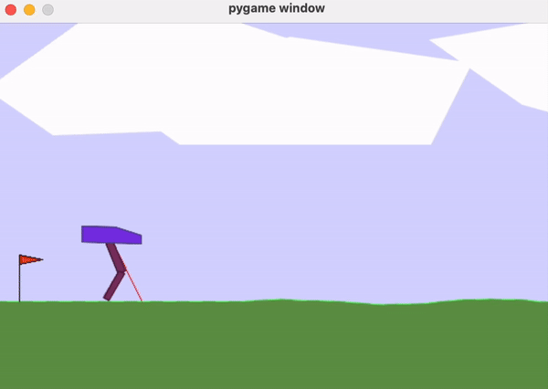
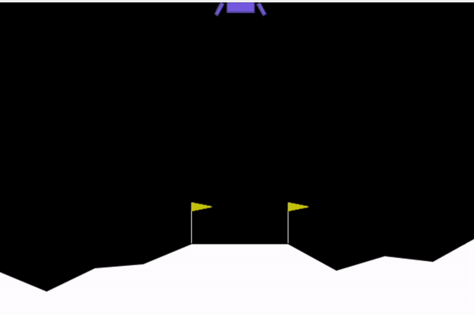
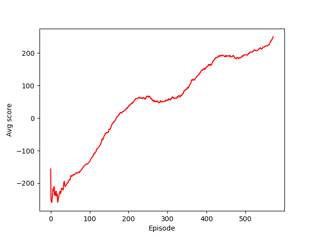

This repository showcases the implementation of various Reinforcement Learning (RL) algorithms. The algorithms, or agents, are organized within modules for ease of use. To get started, install the entire package via pip: `pip install -e.`
For convenience, both training and testing are in Jupyter notebooks.

**Algorithms Implemented**
1. Deep-Q Network (DQN)
2. To be added...

**Games/Environments Tested**
1. Cart-pole
2. Lunar Lander (discrete actions)
3. Lunar Lander (continuous actions)
4. Bipedal Walker
5. To be added...

**Dependencies**

Refer to the environment.yml file to create the virtual environment. Note that `gym` is not included in this file, as its installation method may vary across different operating systems. Ensure that you have `gym` installed correctly on your machine.

**Hardware Used**

The experiments were conducted on a MacBook Pro 16-inch M1 with CPU. The GPU was not activated due to its inconsistent performance.

**Discussion**

1. Deep-Q Network (DQN) \
a) Cart-pole: \
Achieved a score of > 1000 after about **10 minutes** of training.
Further training would likely result in even higher scores.

   

b) Lunar Lander: \
Achieved a score of > 250 after about **30 minutes** of training. \
Note: Sometimes, during training, the ship doesn't move, e.g., it will hover around one position for a long time, leading to a very long training. To deal with this, I stopped an episode when the number of time steps spending on landing exceeds a threshold, e.g., 1000 time steps.

   

2. Deep Deterministic Policy Gradient (DDPG) \
DDPG is very unstable during training, and requires a very careful parameter tuning, especially those related to exploration, e.g., noise. I managed to get it run on Pendulum, Lunar Lander continuous, but not on Bipedal walker (YET).

3. Twin Delayed DDPG (TD3) \
TD3 shows a significant improvement compared to DDPG.
a) Bipedal Walker - Hardcore=False: \
  

b) Lunar Lander - continous=True: \
Achieved a score of > 250 after about **40 minutes** of training, and around **550 episodes**. \
Note: To avoid the situation when the ship hovering at one spot, I punished the agent in each timestep as follows:
`reward = reward - 0.1 * 1.001**time_step`

  
